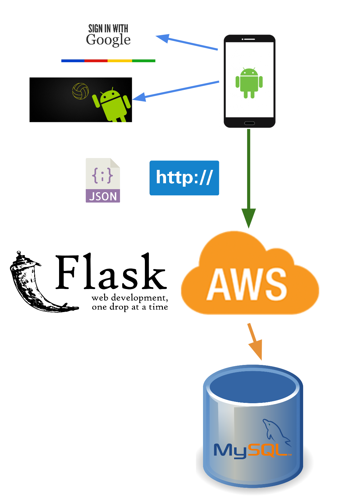
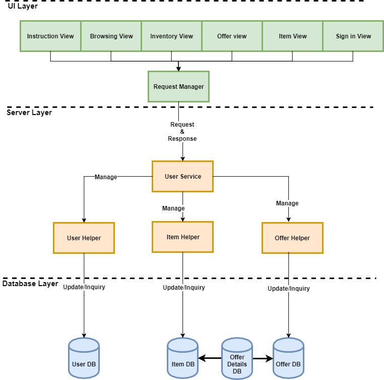
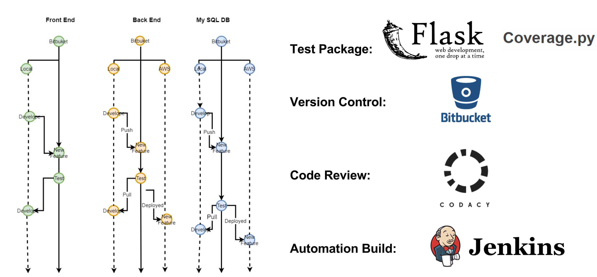

# Barter
Barter is an Android app that provides a platform for people to trade items with other people.

This app is proposed by our client and we built the app according to their requirement within 3 months, as a course project.

----
# Problem
There are so many times where we just buy some stuffs for some special events and never use them again after that event. 

It is both a waste of money and space to go through the same process to accumulate unused stuffs.

----
# Solution

Barter is an Android App that provides a new sharing and trading platform. 

The key feature of the app is as following:

* Log in using Google SignIn
* Add/Edit personal profile - profile must-have information includes: name, email, phone and location (city, country)
* Add/Delete items into user inventory - items must-have information includes: name, brief description, catogory and picture
* Browse items posted by other users, filter for category and location of the item can be added to the browse engine
* Make offer to items user want to trade
* Accept/Decline or Negotiate with the offer proposed by other users
* Browse current/ other users' inventory

---
# Architecture Design

* **Database**: MySQL is used to store all user information, including all profiles, inventories, items, offers
* **Frontend**: Frontend is designed using Android Studio
* **Server**: Server is implemented using Flask
* **Data Transmission**: Data is transmitted using HTTP protocol and all data are send in JSON format
* **Host**: Server is hosted on AWS
* **Google API**: Google API is used in Frontend to enable the user signing in using their google accounts
* **Volley Library**: Volley Library is used in Frontend for HTTP communication to Server

And a more detailed software architecture of Barter is illustrated as below:

User will make different types of requests through different View page, requests will be sent to Server to be processed.

Based on the type of request, user service class will manage User helper, Item helper as well as Offer helper to response. 

Those helpers will communicate with Database to create, delete or update data entries.

---
# Development Flow

The development of Barter is divided into three parts: Frontend, Server and Database

* **Version Control**: Bitbucket is used for version controlling
* **Testing**: For server, tests is written used flask test package, and also used coverage library to perform coverage test.
               For GUI, a set of test cases are generated and tested manually
* **Automation Build**: Jenkins is used for automation build

